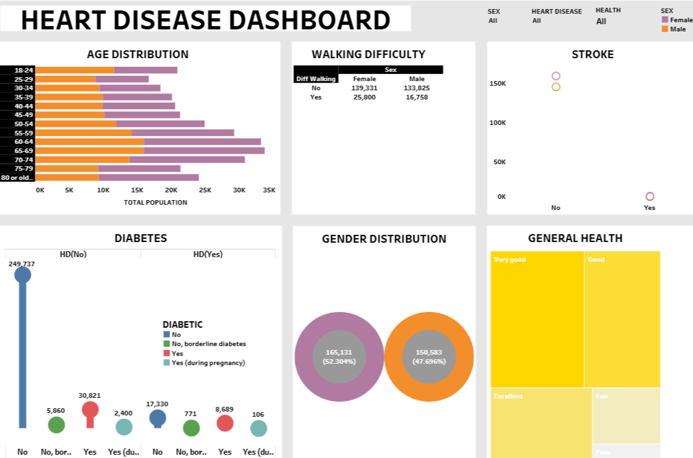

# Data Storyteller Award – Tableau Dashboard
## Project Overview

This project showcases my Tableau dashboard that won the Data Storyteller Award in DS 630 – Data Visualization.
The dashboard was built using the heart disease Dataset to explore patterns, visualize key predictors, and communicate insights effectively.

### Key Highlights:
- Awarded **Data Storyteller** for excellence in data storytelling and dashboard design
- Built using Tableau’s **dashboards + story feature** for clarity and impact
- Insights were presented in a **storybook format (PDF included)**
- Recognition came at the same time as my selection as **President of the Data Science Club**, highlighting both technical and leadership skills

---

## Live Dashboard

👉 [**Click here to view the interactive Tableau Dashboard on Tableau Public**](https://public.tableau.com/app/profile/ajay.raj.singh2783/viz/latestbookv2/final_dashboard)

(Screenshot preview below)


---

📂 Repository Structure
```
📂 data-storyteller-award-dashboard
├── README.md
├── data/
│   └── heart_disease.csv
├── data_analysis/
│   └── indicators_of_heart_disease.ipynb
├── dashboard/
│   └── final_dashboard.twb
├── presentation/
│   └── storybook.pdf
├── images/
│   ├── award-photo.jpg
│   ├── dashboard-screenshot.png
│   └── certificate-snippet.png
```


---

## 🗂 Files Included
- **heart** → Dataset used in Tableau
- **final_dashboard.twb** → Tableau workbook (backup copy)
- **storybook.pdf** → Full presentation used for the award
- **award-photo.jpg** → Proof of recognition
- **LinkedIn Post** → [View announcement of award + presidency](https://www.linkedin.com/feed/update/urn:li:activity:7246560421753536515/)

---

## 🛠️ Tools & Skills
- Tableau Public – Dashboarding, Storytelling, Visualization
- Data Storytelling – Translating data into narratives
- Analytics & Leadership – Recognized by award + Data Science Club Presidency

---

## 📌 Instructions to Run Locally
1. Download the `.twb` file from `dashboard/`.
2. Open in Tableau Desktop or Tableau Public.
3. Load the dataset from `data/`.
